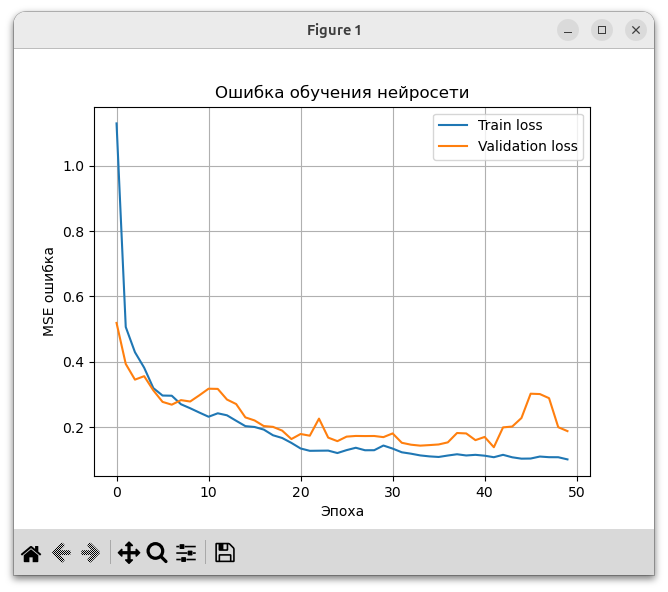
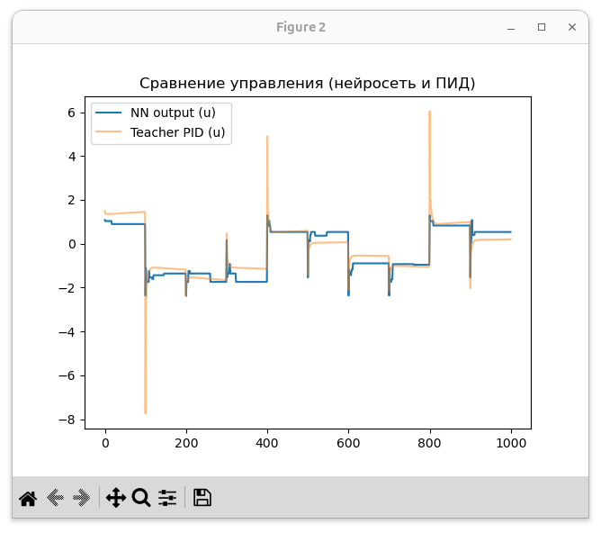

# Нейроморфный ПИД-регулятор для управления двигателем постоянного тока

Проект реализует **ПИД-регулятор с самокалибровкой параметров** на основе нейронной сети с последующим переносом на нейроморфную платформу «Алтай» 

---

## Цель

Разработка адаптивного ПИД-регулятора с оценкой эффективности цифровой и нейроморфной реализации.

---

## Возможности

- Адаптивная настройка параметров ПИД-регулятора.  
- Преобразование ANN → SNN для нейроморфного запуска.  
- Управление двигателем постоянного тока.  
- Визуализация работы регулятора через графики.  
- Поддержка тестирования на физическом стенде.

---

## Графики работы

  

> Скриншоты демонстрируют результаты работы ПИД-регулятора на локальной машине.

